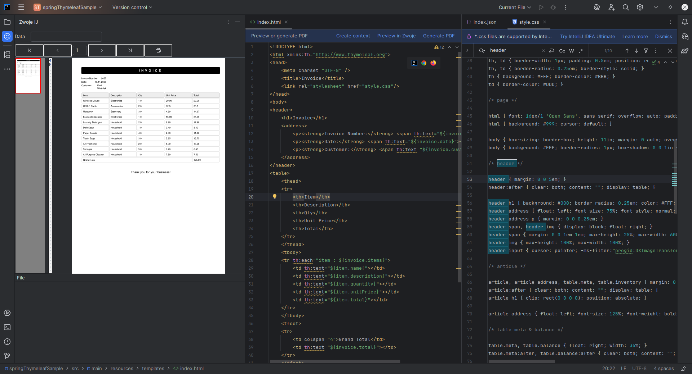

# zwoje

## Info for local development

Project contains of two parts:
* core
* ZwojeIJPlugin

ZwojeIJPlugin uses core as dependency.

To run project locally first publish core ( gradle -> publishToMavenLocal).
Later to see how plugin behave run it with separate Intellij instance (gradle -> runIde).

Use java version > 21

## How it works

